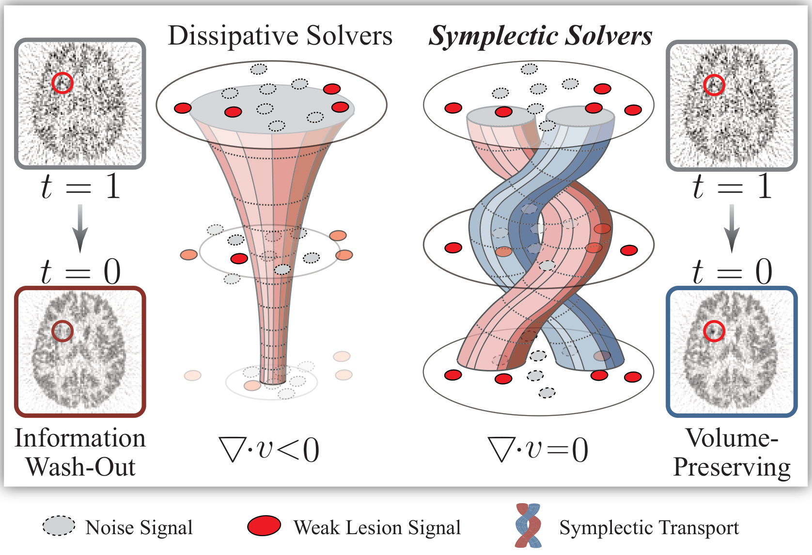
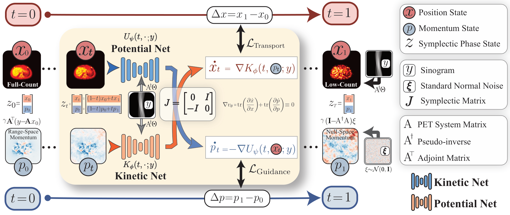
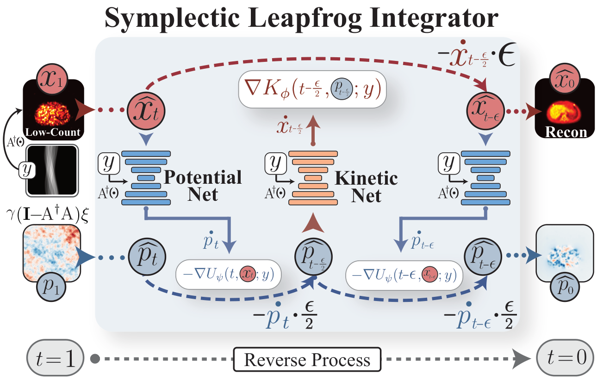

<h1 align="center">FlowPET</h1>

<p align="center">
  <b>Physics-Informed Symplectic Flow Matching for Low-Count PET Reconstruction</b>
</p>

<p align="center">
  Zheng Zhang · Hao Tang · Yingying Hu · Zhanli Hu · Jing Qin
</p>

<p align="center">
  <a href="https://icml.cc/virtual/2026/poster/64602"></a>
  <a href="https://arxiv.org/abs/2607.11104"></a>
  <a href="LICENSE"></a>
</p>

<p align="center">
  <a href="#overview">Overview</a> •
  <a href="#method">Method</a> •
  <a href="#installation">Installation</a> •
  <a href="#data-preparation">Data</a> •
  <a href="#training">Training</a> •
  <a href="#inference-and-evaluation">Evaluation</a> •
  <a href="#citation">Citation</a>
</p>

This repository provides the official PyTorch implementation of **“FlowPET: Physics-Informed Symplectic Flow Matching for Low-Count PET Reconstruction.”**

> **TL;DR** — FlowPET lifts low-count PET reconstruction into a symplectic phase space and learns a divergence-free Hamiltonian flow. Range-space momentum enforces measurement consistency, null-space momentum models unresolved texture, and a Leapfrog integrator preserves phase-space volume during inference.

## Overview

Low-count PET reconstruction must suppress severe counting noise without removing weak, clinically important signals. Dissipative generative dynamics contract phase-space volume and can wash out small lesions together with noise. FlowPET replaces this contraction with volume-preserving symplectic transport.

<p align="center">
  
  <br>
  <sub><b>Motivation.</b> Symplectic transport preserves phase-space volume while separating noise suppression from signal recovery.</sub>
</p>

FlowPET combines three ideas:

- **Separable Hamiltonian dynamics** use independent conditional Kinetic and Potential networks to construct a divergence-free vector field.
- **Range–Null momentum decomposition** separates measurement consistency from stochastic uncertainty.
- **Symplectic Leapfrog inference** preserves phase-space volume under numerical integration.

## Method

FlowPET augments the image state `x` with momentum `p` and defines a separable Hamiltonian

$$
H_\theta(t,x,p;y)=U_\psi(t,x;y)+K_\phi(t,p;y),
$$

which gives the canonical dynamics

$$
\dot{x}=\nabla_p K_\phi(t,p;y), \qquad
\dot{p}=-\nabla_x U_\psi(t,x;y).
$$

The Kinetic network `K_φ` and Potential network `U_ψ` are independent conditional U-Nets. Both receive the static measurement condition $A^\top y$. Their block-structured vector field has zero divergence by construction.

The paper configuration uses 128 base channels with multipliers `[1, 2, 4, 8]` for the Kinetic network and 64 base channels with multipliers `[1, 2, 4]` for the lightweight Potential network. Both branches use two residual blocks per level and share only the static-condition adapter.

<p align="center">
  
  <br>
  <sub><b>FlowPET framework.</b> Physics-informed phase-space construction, conditional Hamiltonian flow matching, and symplectic reconstruction.</sub>
</p>

### Physics-informed phase-space boundaries

For a full-count target $x_0$ and low-count measurement $y$, the phase-space boundaries are

$$
x_1=A^\dagger y, \qquad
p_0=\gamma A^\top(y-Ax_0), \qquad
p_1=\gamma(I-A^\dagger A)\xi, \quad \xi\sim\mathcal{N}(0,I).
$$

Here, $A^\dagger$ is implemented with filtered back-projection. The restoring momentum $p_0$ lies in the measurement-informed range space, while $p_1$ confines stochastic variation to the null space. The released configuration uses $\gamma=10^{-2}$, selected in the paper’s ablation study.

### Structure-preserving inference

At inference, FlowPET initializes $(x_1,p_1)$ from the measurement and integrates the learned dynamics backward from $t=1$ to $t=0$ with four Leapfrog steps.

<p align="center">
  
  <br>
  <sub><b>Inference.</b> Four backward Leapfrog steps alternate the Kinetic and Potential updates.</sub>
</p>

## Installation

FlowPET requires Python 3.10, PyTorch 2.1.1, CUDA, and a CUDA-compatible TorchRadon installation.

```bash
conda create -n flowpet python=3.10 -y
conda activate flowpet
pip install -r requirements.txt
```

Core dependencies include:

- PyTorch 2.1.1 and torchvision 0.16.1
- [TorchRadon](https://github.com/matteo-ronchetti/torch-radon)
- `pytorch_wavelets`, `scikit-image`, `lmdb`, and `PyYAML`

TorchRadon performs the PET projection and back-projection on CUDA tensors. Install a build compatible with the local CUDA and C++ runtime if the package supplied by `pip` is unavailable on your platform.

## Data Preparation

Datasets and pretrained weights are not distributed with this repository. The released pediatric loader expects paired LMDB databases containing full-count and synthetic 1% image-domain reconstructions. Set the paths in [`configs/FlowPET.yml`](configs/FlowPET.yml):

```yaml
dataset_paths:
  train:
    full: /path/to/train_full.lmdb
    ultra_ultra_low: /path/to/train_1percent.lmdb
  val:
    full: /path/to/test_full.lmdb
    ultra_ultra_low: /path/to/test_1percent.lmdb
```

Each LMDB uses zero-padded integer keys such as `000000`. Corresponding dose databases must have the same number and ordering of slices.

The pediatric files are stored in the image domain. During training and image-based evaluation, the code constructs the measurement as

$$
y=A(x_{\mathrm{degraded}}),
$$

then computes the FBP initialization $x_1=A^\dagger y$ and the independent static condition $A^\top y$. The public reconstruction interface also accepts a sinogram `y` directly and does not require a full-count reference.

## Training

The classic paper-aligned experiment is defined in [`configs/FlowPET.yml`](configs/FlowPET.yml).

Single GPU:

```bash
python train.py --config_exp configs/FlowPET.yml
```

Distributed training:

```bash
torchrun --standalone --nproc_per_node=4 \
  train.py --config_exp configs/FlowPET.yml
```

The paper uses four RTX 3090 GPUs, global batch size 8, AdamW, and cosine learning-rate decay from `1e-4` to `1e-6` over 500,000 optimizer updates. `batch_size` is global and must be divisible by the number of distributed ranks.

Checkpoints, logs, metrics, and validation figures are saved under `outputs/<exp_name>/`. Training automatically resumes from `last.pth.tar` when the output directory contains a compatible checkpoint.

## Inference and Evaluation

For measurement-domain reconstruction:

```python
from trains.flowpet_trainer import reconstruct_from_sinogram

# y: measured sinogram; model: trained FlowPET; imaging_system: PET operator
reconstruction = reconstruct_from_sinogram(
    y, model, imaging_system, config, num_steps=4
)
```

To evaluate a trained experiment directory:

```bash
python evaluate.py \
  --base_dir outputs \
  --only_models FlowPET_Pediatric_1percent \
  --data_selection ultra_ultra_low \
  --num_samples 145 \
  --val_sampling_steps 4 \
  --solver leapfrog
```

Each model directory must contain its YAML configuration and `checkpoint.pth.tar`. Evaluation reports slice-mean SSIM, PSNR, and RMSE with standard deviations. Images are clipped to `[0,1]`, and all metrics use a fixed data range of 1. Results are written to `batch_evaluation_results/` by default, including `evaluation_metrics_leapfrog_4.json`.

## Repository Structure

```text
configs/                 Paper-aligned experiment configuration
data/                    LMDB pediatric PET loader
models/unet/             Conditional Kinetic and Potential networks
physics/                 PET projection, adjoint, and FBP operators
trains/                  Flow matching, momentum boundaries, and Leapfrog solver
utils/                   Registries, metrics, and configuration helpers
train.py                 Training entry point
evaluate.py              Batch evaluation entry point
evaluation.py            Reconstruction and metric helpers
```

## Citation

If you find this work useful, please cite:

```bibtex
@inproceedings{zhang2026flowpet,
  title     = {FlowPET: Physics-Informed Symplectic Flow Matching for Low-Count PET Reconstruction},
  author    = {Zhang, Zheng and Tang, Hao and Hu, Yingying and Hu, Zhanli and Qin, Jing},
  booktitle = {Proceedings of the 43rd International Conference on Machine Learning},
  year      = {2026}
}
```

## Acknowledgements

The conditional U-Net design is adapted from [Guided Diffusion](https://github.com/openai/guided-diffusion). PET projection and back-projection use [TorchRadon](https://github.com/matteo-ronchetti/torch-radon).

## License

FlowPET is released under the [MIT License](LICENSE). Third-party components retain their original licenses; in particular, `utils/utils.py` carries a CC BY-NC 4.0 notice.
